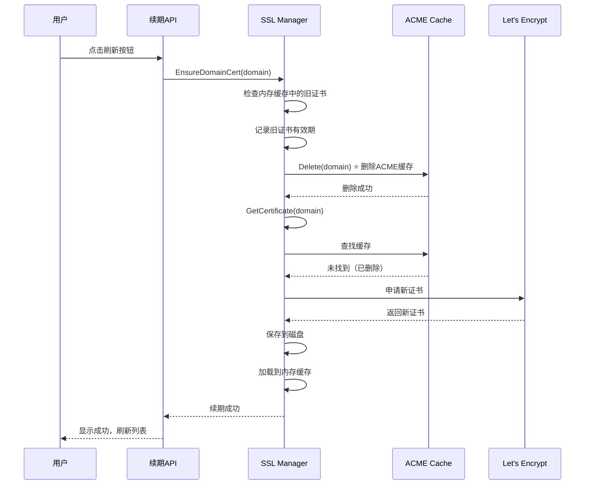

# 证书续期缓存问题修复

## 问题现象

用户点击证书"刷新"按钮后，看到提示说"Let's Encrypt验证成功"，但是：
1. 刷新页面后，证书有效期仍然显示11天后过期
2. 证书文件的修改时间没有更新（仍然是10月份的旧证书）
3. ACME缓存目录中的证书也没有更新

## 问题排查过程

### 1. 时区误判
最初以为服务器上的代码不是最新的（因为文件时间是 Dec 26 08:39），但实际上服务器使用UTC时间，对应北京时间16:39，是最新的代码。

### 2. 证书文件检查
```bash
# 证书目录
ls -lht /var/lib/sslcat/certs/
# 最后修改时间：Oct 23 11:03

# 证书有效期
openssl x509 -in /var/lib/sslcat/certs/83d.me.crt -noout -dates
# notBefore=Oct  7 15:59:52 2025 GMT
# notAfter=Jan  5 15:59:51 2026 GMT  ← 还有11天过期

# ACME缓存
ls -lht /var/lib/sslcat/acme-cache/
openssl x509 -in /var/lib/sslcat/acme-cache/83d.me -noout -dates
# notBefore=Oct  7 16:00:10 2025 GMT
# notAfter=Jan  5 16:00:09 2026 GMT  ← 也是旧证书
```

### 3. 根本原因定位

**问题根源**：`autocert.Manager.GetCertificate()` 的工作机制

autocert 包的 `GetCertificate()` 方法会：
1. 首先检查缓存中是否有证书
2. 如果有证书，检查证书是否在有效期内
3. **只有在证书快过期（默认30天内）时才会自动续期**
4. 如果证书还没到续期时间，直接返回缓存中的旧证书

在我们的场景中：
- 证书还有11天才过期
- autocert 认为不需要续期
- 直接从 ACME 缓存返回旧证书
- 虽然 HTTP-01 验证可能成功了（因为域名解析正常），但实际上没有向 Let's Encrypt 申请新证书

## 解决方案

在 `EnsureDomainCert` 函数中，**强制删除 ACME 缓存中的旧证书**，然后再调用 `GetCertificate()`。

### 修改代码

```go
// EnsureDomainCert 主动为指定域名申请（或加载）证书（当启用 ACME 时）
func (m *Manager) EnsureDomainCert(domain string) error {
    // ... 前面的代码 ...
    
    // 检查是否已有证书，记录旧证书的有效期
    if existingCert := m.getCertificateFromCache(domain); existingCert != nil {
        if x509Cert, err := x509.ParseCertificate(existingCert.Certificate[0]); err == nil {
            m.log.Infof("Existing certificate found for %s: NotBefore=%v, NotAfter=%v, DaysRemaining=%.1f",
                domain, x509Cert.NotBefore, x509Cert.NotAfter, time.Until(x509Cert.NotAfter).Hours()/24)
            
            // ⭐ 关键修复：强制删除ACME缓存中的旧证书，以触发重新申请
            if m.acmeMgr.Cache != nil {
                m.log.Infof("Deleting ACME cache for %s to force renewal", domain)
                if err := m.acmeMgr.Cache.Delete(context.Background(), domain); err != nil {
                    m.log.Warnf("Failed to delete ACME cache for %s: %v (will continue anyway)", domain, err)
                } else {
                    m.log.Infof("ACME cache deleted successfully for %s", domain)
                }
            }
        }
    }
    
    // ... 后面的代码 ...
}
```

### 工作流程

修复后的续期流程：



## 测试验证

### 预期行为

1. **日志输出**：
```
[INFO] Certificate request initiated for domain: 83d.me
[INFO] Existing certificate found for 83d.me: NotBefore=..., NotAfter=2026-01-05, DaysRemaining=11.0
[INFO] Deleting ACME cache for 83d.me to force renewal
[INFO] ACME cache deleted successfully for 83d.me
[INFO] New certificate obtained for 83d.me: NotBefore=2025-12-26, NotAfter=2026-03-26, ValidDays=90.0
[INFO] Certificate saved to disk: cert=/var/lib/sslcat/certs/83d.me.crt, key=/var/lib/sslcat/keys/83d.me.key
[INFO] Certificate successfully loaded from disk to cache: 83d.me
[INFO] Loaded certificate verification for 83d.me: NotAfter=2026-03-26, DaysRemaining=90.0
```

2. **文件更新**：
```bash
# 证书文件时间应该更新为当前时间
ls -lh /var/lib/sslcat/certs/83d.me.crt
# -rw-r--r-- 1 root root 3.5K Dec 26 16:50 83d.me.crt  ← 新时间

# 证书有效期应该更新为90天
openssl x509 -in /var/lib/sslcat/certs/83d.me.crt -noout -dates
# notBefore=Dec 26 08:50:00 2025 GMT  ← 新证书
# notAfter=Mar 26 08:50:00 2026 GMT   ← 90天后过期
```

3. **前端显示**：
- 进度对话框显示续期步骤
- 成功提示
- 证书列表自动刷新
- 有效期显示为新的日期（约90天）

## 部署步骤

### 1. 在服务器上更新代码

```bash
# SSH 到服务器
ssh rocky@shifen.de

# 进入项目目录（假设代码在某个目录）
cd /path/to/sslcat-source

# 拉取最新代码
git pull origin main
git checkout v1.3.31-rc3

# 编译
make build

# 复制到运行目录
sudo cp build/sslcat /opt/sslcat/sslcat

# 重启服务
sudo systemctl restart sslcat

# 查看日志
sudo journalctl -u sslcat -f
```

### 2. 测试续期功能

1. 访问管理面板：https://shifen.de/sslcat-panel/
2. 进入SSL证书管理页面
3. 找到 83d.me 或 aliaudio.some.im
4. 点击"刷新"按钮
5. 观察进度对话框
6. 等待续期完成
7. 验证证书有效期是否更新

### 3. 验证日志

```bash
# 查看续期日志
ssh rocky@shifen.de "sudo journalctl -u sslcat --since '5 minutes ago' | grep -E 'Certificate|ACME cache'"
```

应该能看到：
- `Deleting ACME cache for xxx to force renewal`
- `ACME cache deleted successfully for xxx`
- `New certificate obtained for xxx`
- `Certificate saved to disk`

## 注意事项

1. **Let's Encrypt 速率限制**：
   - 每个域名每周最多续期5次
   - 测试时注意不要频繁续期同一域名

2. **ACME 缓存的作用**：
   - 正常情况下，ACME 缓存用于避免频繁向 Let's Encrypt 申请证书
   - 我们的修复只在手动续期时删除缓存
   - 自动续期仍然会利用缓存机制

3. **备份建议**：
   - 在续期前，建议备份旧证书
   - 如果续期失败，可以恢复旧证书

## 相关文件

- `internal/ssl/manager.go` - SSL管理器，包含证书续期逻辑
- `internal/web/api_ssl.go` - SSL API，包含续期接口
- `frontend/src/pages/SSLManagement.tsx` - 前端SSL管理页面

## 版本信息

- 修复版本：v1.3.31-rc3
- 提交：b7c28e9
- 日期：2025-12-26

