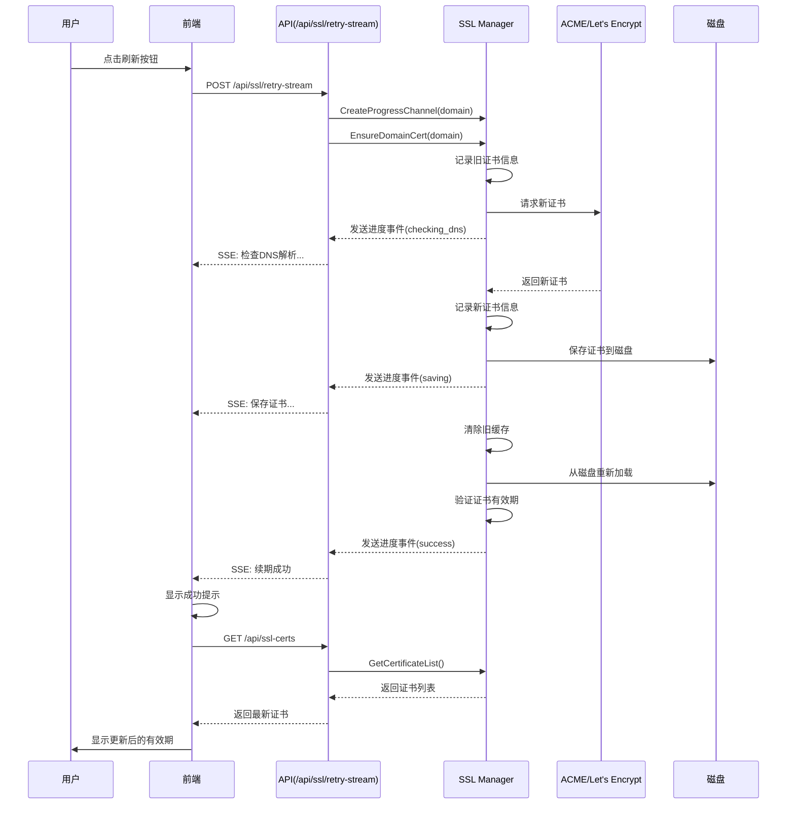

# 证书续期问题修复实施总结

## 问题描述

用户反馈：点击证书"刷新"按钮后，虽然提示证书申请成功，但刷新页面后发现证书有效期仍然显示11天即将过期，没有更新。

## 根本原因分析

通过代码审查发现以下问题：

1. **缺少实时进度反馈**：证书续期使用的是同步API（`/api/ssl/retry`），用户无法看到续期过程，只能等待结果
2. **缓存刷新不彻底**：续期成功后，虽然证书保存到磁盘，但可能没有强制刷新内存缓存
3. **日志记录不足**：续期过程中缺少详细的日志，无法追踪证书是否真正更新
4. **前端显示问题**：前端可能显示的是缓存数据，而不是最新的证书信息

## 解决方案

### 1. 后端改进

#### 1.1 新增SSE续期API

**文件**：`internal/web/api_ssl.go`

新增 `handleAPISSLRetryStream` 函数，支持Server-Sent Events (SSE)实时推送续期进度：

```go
func (s *Server) handleAPISSLRetryStream(w http.ResponseWriter, r *http.Request)
```

**特性**：
- 设置SSE响应头（`Content-Type: text/event-stream`）
- 创建进度通道接收续期事件
- 实时推送进度事件到客户端
- 支持成功、失败、进度等多种状态

#### 1.2 增强日志记录

**文件**：`internal/ssl/manager.go`

在 `EnsureDomainCert` 函数中添加详细日志：

- **续期开始**：记录请求信息和旧证书有效期
  ```
  Certificate request initiated for domain: xxx
  Existing certificate found for xxx: NotBefore=..., NotAfter=..., DaysRemaining=...
  ```

- **证书获取**：记录新证书的有效期信息
  ```
  New certificate obtained for xxx: NotBefore=..., NotAfter=..., ValidDays=...
  ```

- **证书保存**：记录保存路径
  ```
  Certificate saved to disk: cert=/data/certs/xxx.crt, key=/data/keys/xxx.key
  ```

- **缓存加载**：记录加载结果和验证信息
  ```
  Reloading certificate from disk to ensure cache is up-to-date: xxx
  Certificate successfully loaded from disk to cache: xxx
  Loaded certificate verification for xxx: NotAfter=..., DaysRemaining=...
  ```

#### 1.3 强制缓存刷新

**文件**：`internal/ssl/manager.go`

改进证书保存和加载逻辑：

1. **保存成功后清除旧缓存**：
   ```go
   m.certMutex.Lock()
   delete(m.certCache, domain)
   m.certMutex.Unlock()
   ```

2. **从磁盘重新加载**：
   ```go
   if loadErr := m.LoadCertificateFromDisk(domain); loadErr != nil {
       // 处理加载失败
   }
   ```

3. **验证加载的证书**：
   ```go
   if loadedCert := m.getCertificateFromCache(domain); loadedCert != nil {
       if x509Cert, err := x509.ParseCertificate(loadedCert.Certificate[0]); err == nil {
           m.log.Infof("Loaded certificate verification for %s: NotAfter=%v, DaysRemaining=%.1f",
               domain, x509Cert.NotAfter, time.Until(x509Cert.NotAfter).Hours()/24)
       }
   }
   ```

#### 1.4 新增辅助方法

**文件**：`internal/ssl/manager.go`

```go
// getCertificateFromCache 从缓存中获取证书（线程安全）
func (m *Manager) getCertificateFromCache(domain string) *tls.Certificate {
    m.certMutex.RLock()
    defer m.certMutex.RUnlock()
    return m.certCache[domain]
}
```

#### 1.5 路由注册

**文件**：`internal/web/server.go`

```go
s.mux.HandleFunc(s.config.AdminPrefix+"/api/ssl/retry-stream", s.handleAPISSLRetryStream)
```

### 2. 前端改进

#### 2.1 改造续期函数

**文件**：`frontend/src/pages/SSLManagement.tsx`

将 `renewCertificate` 函数改为支持SSE：

```typescript
const renewCertificate = async (domain: string) => {
    // 打开进度对话框
    setRenewDomain(domain)
    setRenewProgressEvents([])
    setRenewing(true)
    onRenewOpen()

    // 调用SSE API
    const response = await fetch(buildApiPath(adminPrefix, '/ssl/retry-stream'), {
        method: 'POST',
        headers: { 'Content-Type': 'application/json' },
        credentials: 'include',
        body: JSON.stringify({ domain: domain.trim() }),
    })

    // 接收SSE事件
    const reader = response.body?.getReader()
    const decoder = new TextDecoder()
    // ... 处理SSE事件流
}
```

#### 2.2 新增状态管理

```typescript
const [renewing, setRenewing] = useState(false)
const [renewDomain, setRenewDomain] = useState('')
const [renewProgressEvents, setRenewProgressEvents] = useState<Array<{...}>>([])
const { isOpen: isRenewOpen, onOpen: onRenewOpen, onClose: onRenewClose } = useDisclosure()
```

#### 2.3 新增续期进度对话框

完整的Modal组件，包括：
- 域名显示
- 实时进度条
- 进度事件列表
- 成功/失败状态显示
- 错误信息提示

### 3. 技术架构



## 实施的文件清单

### 后端文件
1. `internal/web/api_ssl.go` - 新增SSE续期API
2. `internal/ssl/manager.go` - 增强日志和缓存刷新
3. `internal/web/server.go` - 注册新路由

### 前端文件
1. `frontend/src/pages/SSLManagement.tsx` - 改造续期函数和UI

### 文档文件
1. `CERT_RENEWAL_TEST_GUIDE.md` - 测试指南
2. `CERT_RENEWAL_IMPLEMENTATION_SUMMARY.md` - 实施总结（本文档）

## 关键改进点

### 1. 用户体验提升
- ✅ 实时进度显示，用户可以看到续期的每一步
- ✅ 清晰的成功/失败提示
- ✅ 详细的错误信息，帮助用户理解问题

### 2. 问题诊断能力
- ✅ 完整的日志记录，包括证书有效期对比
- ✅ 每个关键步骤都有日志
- ✅ 便于追踪证书是否真正更新

### 3. 数据一致性
- ✅ 强制刷新缓存，确保内存和磁盘一致
- ✅ 验证加载的证书有效期
- ✅ 前端自动刷新证书列表

### 4. 代码质量
- ✅ 复用现有的SSE机制
- ✅ 线程安全的缓存操作
- ✅ 完善的错误处理

## 测试建议

1. **功能测试**：按照 `CERT_RENEWAL_TEST_GUIDE.md` 进行完整测试
2. **日志验证**：确认日志记录完整且有用
3. **边界测试**：测试续期失败的场景
4. **并发测试**：测试多个域名同时续期

## 部署步骤

### 1. 编译代码

```bash
cd /Users/rocky/Sites/sslcat
make build
```

### 2. 编译前端（如果需要）

```bash
cd frontend
yarn build
```

### 3. 部署到服务器

使用现有的部署脚本：

```bash
bash deploy-to-s2.sh
```

### 4. 重启服务

```bash
sudo systemctl restart sslcat
```

### 5. 验证功能

访问管理面板，测试证书续期功能。

## 监控和维护

### 日志位置
- 应用日志：`/var/log/sslcat/sslcat.log`
- 系统日志：`journalctl -u sslcat -f`

### 关键日志关键词
- `Certificate request initiated`
- `Existing certificate found`
- `New certificate obtained`
- `Certificate saved to disk`
- `Certificate successfully loaded from disk to cache`
- `Loaded certificate verification`

### 监控指标
- 证书续期成功率
- 续期耗时
- 缓存刷新成功率
- API响应时间

## 已知限制

1. **Let's Encrypt速率限制**：每个域名每周最多续期5次
2. **DNS传播延迟**：DNS-01验证可能需要等待DNS记录传播
3. **网络依赖**：需要服务器能访问Let's Encrypt API

## 后续优化建议

1. **添加续期历史**：记录每次续期的时间和结果
2. **智能续期策略**：根据证书剩余天数自动选择续期时机
3. **批量续期**：支持一次性续期多个证书
4. **续期失败重试**：自动重试失败的续期请求
5. **通知集成**：续期成功/失败时发送通知

## 总结

本次修复解决了证书续期后有效期不更新的问题，主要通过以下措施：

1. **增加透明度**：通过SSE实时显示续期进度
2. **强化日志**：记录完整的续期过程，便于问题诊断
3. **确保一致性**：强制刷新缓存，确保显示最新数据
4. **改善体验**：提供清晰的成功/失败反馈

这些改进不仅解决了当前问题，还为未来的功能扩展和问题排查奠定了基础。

