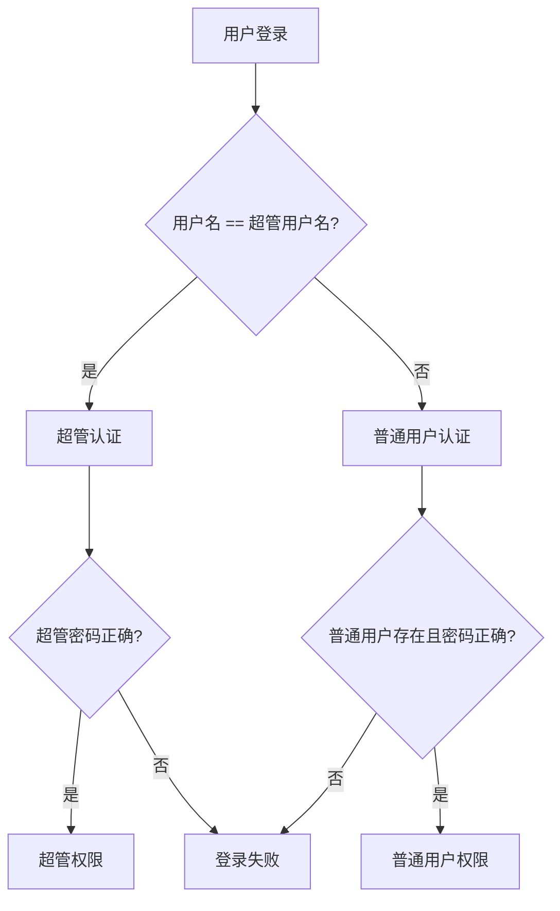

# SSLcat 用户名冲突修复方案

## 问题分析

### 原始问题
SSLcat 存在用户名冲突的安全风险：
- **超管用户名**：默认 `"admin"`（配置文件中的 `admin.username`）
- **普通用户**：可以创建名为 `"admin"` 的用户
- **认证优先级**：原始代码中普通用户认证优先于超管认证

### 安全风险
1. **权限混淆**：同名用户可能获得不同的权限
2. **安全绕过**：攻击者可能通过创建同名普通用户来绕过超管认证
3. **权限提升**：普通用户可能意外获得超管权限

## 修复方案

### 1. 认证优先级调整

**修复前**：
```
用户登录 → 尝试普通用户认证 → 失败 → 尝试超管认证
```

**修复后**：
```
用户登录 → 检查是否为超管用户名 → 是：超管认证 | 否：普通用户认证
```

### 2. 用户名冲突检查

#### 新增冲突管理器
```go
type UserConflictManager struct {
    adminUsername string
    log           UserLogger
}
```

#### 冲突检查逻辑
- **超管用户名**：不允许创建同名普通用户
- **保留用户名**：`root`, `administrator`, `superuser`, `system`, `sslcat` 等
- **自动建议**：提供安全的用户名建议

### 3. 认证流程优化

#### 新的认证流程


## 代码修改

### 1. 新增文件
- `internal/web/user_conflict_fix.go` - 用户冲突管理器

### 2. 修改文件
- `internal/web/user_manager.go` - 集成冲突检查
- `internal/web/handlers.go` - 优化认证逻辑
- `internal/web/api_auth.go` - 优化 API 认证逻辑

### 3. 关键修改

#### 用户创建时的冲突检查
```go
// 检查用户名冲突
if err := um.conflictManager.ValidateUsername(username); err != nil {
    return err
}
```

#### 认证优先级调整
```go
// 1. 首先检查是否为超管用户名
usernameMatch := username == s.config.Admin.Username
if usernameMatch {
    // 超管用户名，优先使用超管认证
    passwordMatch := s.verifyAdminPassword(password)
    // ...
} else {
    // 非超管用户名，尝试普通用户认证
    user, err := s.userManager.AuthenticateUser(username, password)
    // ...
}
```

## 安全改进

### 1. 防止权限混淆
- 超管用户名始终使用超管认证
- 普通用户无法创建与超管同名的账户

### 2. 防止安全绕过
- 攻击者无法通过创建同名普通用户来绕过超管认证
- 超管认证优先级明确

### 3. 防止权限提升
- 普通用户无法意外获得超管权限
- 认证逻辑清晰明确

## 向后兼容性

### 1. 现有用户
- 现有的普通用户不受影响
- 只有创建新用户时才会进行冲突检查

### 2. 配置文件
- 超管用户名配置保持不变
- 认证逻辑优化不影响现有配置

### 3. API 兼容性
- API 接口保持不变
- 认证行为更加安全和可预测

## 测试建议

### 1. 功能测试
- 测试超管用户名登录
- 测试普通用户名登录
- 测试用户名冲突检查

### 2. 安全测试
- 测试同名用户创建被阻止
- 测试认证优先级正确
- 测试权限分配正确

### 3. 边界测试
- 测试大小写不敏感的用户名匹配
- 测试保留用户名检查
- 测试用户名建议功能

## 总结

这个修复方案解决了 SSLcat 中用户名冲突的安全风险：

1. **认证优先级明确**：超管用户名始终使用超管认证
2. **冲突检查完善**：防止创建与超管同名的普通用户
3. **安全防护增强**：防止权限混淆和安全绕过
4. **向后兼容**：不影响现有用户和配置

通过这些修改，SSLcat 的认证系统更加安全和可靠。🛡️
