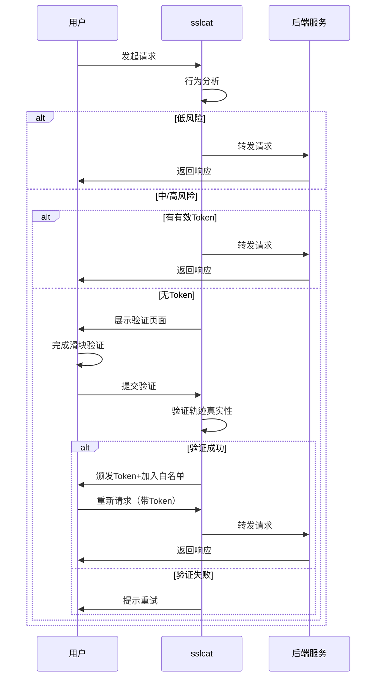

# 机器人检测功能

## 概述

sslcat 内置了智能机器人检测功能，通过行为分析识别可疑访问，并在必要时要求用户完成滑块验证。该功能可以有效防止恶意爬虫、自动化攻击和其他机器人行为。

## 功能特性

### 1. 多维度行为分析

机器人检测系统通过以下维度分析访问行为：

- **访问频率检测**：统计 1 分钟和 1 小时内的请求数，识别异常高频访问
- **User-Agent 分析**：识别常见爬虫工具（Scrapy、Selenium、PhantomJS 等）
- **请求模式分析**：检测路径遍历、参数爆破等非人类行为
- **JavaScript 能力检测**：通过 Cookie 标记识别无 JS 能力的客户端

### 2. 风险评分系统

系统会为每个请求计算风险评分（0-100 分），并根据配置的阈值采取不同动作：

- **低风险（< 30 分）**：直接放行
- **中风险（30-70 分）**：检查验证 Token，有效则放行
- **高风险（> 70 分）**：强制要求完成验证

### 3. 滑块验证

当检测到可疑访问时，系统会展示滑块验证页面：

- 现代化的 UI 设计
- 轨迹真实性验证（检测速度变化、时间合理性）
- 防重放攻击（挑战一次性使用）
- 移动端适配

### 4. 白名单机制

验证通过后，系统会：

- 颁发加密 Token（默认 24 小时有效）
- 将 IP 加入白名单（默认 7 天有效）
- 自动续期（每次访问更新验证时间）

## 配置说明

### 按域名配置

在代理规则中添加机器人检测配置：

\`\`\`json
{
  "domain": "example.com",
  "target": "localhost:3000",
  "bot_detection_enabled": true,
  "bot_detection_config": {
    "mode": "challenge",
    "low_risk_threshold": 30,
    "medium_risk_threshold": 50,
    "high_risk_threshold": 70,
    "max_requests_per_minute": 60,
    "max_requests_per_hour": 1000,
    "whitelist_duration": 168,
    "token_duration": 24,
    "skip_paths": ["/api/health", "/api/status"]
  }
}
\`\`\`

### 配置参数说明

| 参数 | 类型 | 默认值 | 说明 |
|------|------|--------|------|
| `mode` | string | "monitor" | 检测模式：`monitor`（仅记录）或 `challenge`（验证） |
| `low_risk_threshold` | int | 30 | 低风险阈值 |
| `medium_risk_threshold` | int | 50 | 中风险阈值 |
| `high_risk_threshold` | int | 70 | 高风险阈值 |
| `max_requests_per_minute` | int | 60 | 每分钟最大请求数 |
| `max_requests_per_hour` | int | 1000 | 每小时最大请求数 |
| `whitelist_duration` | int | 168 | 白名单有效期（小时） |
| `token_duration` | int | 24 | Token 有效期（小时） |
| `skip_paths` | []string | [] | 跳过验证的路径列表 |

## 使用方式

### 1. 启用机器人检测

在管理面板的"安全"页面中：

1. 选择要配置的域名
2. 开启"启用机器人检测"开关
3. 选择检测模式（建议先使用"监控模式"观察效果）
4. 调整风险阈值和频率限制
5. 保存配置

### 2. 监控模式

监控模式下，系统会：

- 分析所有请求并计算风险评分
- 记录检测日志到数据库
- 不会拦截任何请求
- 适合用于观察和调优

### 3. 验证模式

验证模式下，系统会：

- 对高风险请求展示验证页面
- 要求用户完成滑块验证
- 验证通过后颁发 Token 和加入白名单
- 白名单内的 IP 免验证

### 4. 查看统计

在管理面板中可以查看：

- 白名单数量
- 追踪的 IP 数
- 活跃挑战数
- 检测日志

## API 接口

### 获取配置

\`\`\`bash
GET /sslcat-panel/api/bot-detection/config?domain=example.com
\`\`\`

### 更新配置

\`\`\`bash
PUT /sslcat-panel/api/bot-detection/config
Content-Type: application/json

{
  "domain": "example.com",
  "enabled": true,
  "config": {
    "mode": "challenge",
    "low_risk_threshold": 30,
    ...
  }
}
\`\`\`

### 获取统计

\`\`\`bash
GET /sslcat-panel/api/bot-detection/stats
\`\`\`

### 获取白名单

\`\`\`bash
GET /sslcat-panel/api/bot-detection/whitelist?domain=example.com
\`\`\`

### 删除白名单条目

\`\`\`bash
DELETE /sslcat-panel/api/bot-detection/whitelist?ip=1.2.3.4&domain=example.com
\`\`\`

## 验证流程

## 最佳实践

### 1. 渐进式启用

建议按以下步骤启用机器人检测：

1. **监控模式**：先使用监控模式运行 1-2 天，观察检测效果
2. **调整阈值**：根据日志调整风险阈值，降低误报率
3. **验证模式**：确认配置合理后，切换到验证模式
4. **持续优化**：定期查看统计数据，优化配置

### 2. 跳过路径配置

对于以下路径，建议跳过验证：

- 健康检查接口：`/health`, `/ping`
- 状态接口：`/status`, `/metrics`
- Webhook 回调：`/webhook/*`
- API 接口（如果有其他认证机制）

### 3. 频率限制设置

根据网站特性设置合理的频率限制：

- **内容网站**：60 次/分钟，1000 次/小时
- **API 服务**：120 次/分钟，5000 次/小时
- **静态资源**：300 次/分钟，10000 次/小时

### 4. 白名单管理

- 定期清理过期的白名单条目
- 对于已知的可信 IP，可以手动添加到白名单
- 监控白名单增长速度，异常增长可能表示配置需要调整

## 性能影响

机器人检测功能经过优化，对性能影响很小：

- **内存占用**：每个追踪的 IP 约占用 1KB 内存
- **CPU 开销**：每个请求增加约 0.1-0.5ms 处理时间
- **数据库**：使用 SQLite 存储，定期清理旧日志

## 故障排查

### 误报问题

如果正常用户被误判为机器人：

1. 检查用户的 User-Agent 是否异常
2. 降低风险阈值
3. 增加频率限制
4. 将用户 IP 加入白名单

### 漏报问题

如果机器人未被检测到：

1. 提高风险阈值的敏感度
2. 降低频率限制
3. 检查机器人是否使用了正常的 User-Agent
4. 启用 JavaScript 能力检测

### 验证页面无法显示

1. 检查浏览器控制台是否有 JavaScript 错误
2. 确认 `/bot-challenge/verify` 接口可访问
3. 检查 Cookie 是否被禁用

## 安全建议

1. **定期更新 Token 密钥**：修改配置中的 `SecretKey`
2. **监控异常行为**：关注白名单异常增长
3. **结合其他安全措施**：与 WAF、DDoS 防护配合使用
4. **日志审计**：定期审查检测日志

## 限制说明

1. 机器人检测无法 100% 准确识别所有机器人
2. 高级机器人可能会模拟人类行为绕过检测
3. 验证页面需要 JavaScript 支持
4. 白名单基于 IP，动态 IP 用户可能需要多次验证

## 更新日志

### v1.4.0 (2025-01-01)

- 首次发布机器人检测功能
- 支持行为分析和滑块验证
- 支持按域名配置
- 提供白名单管理

