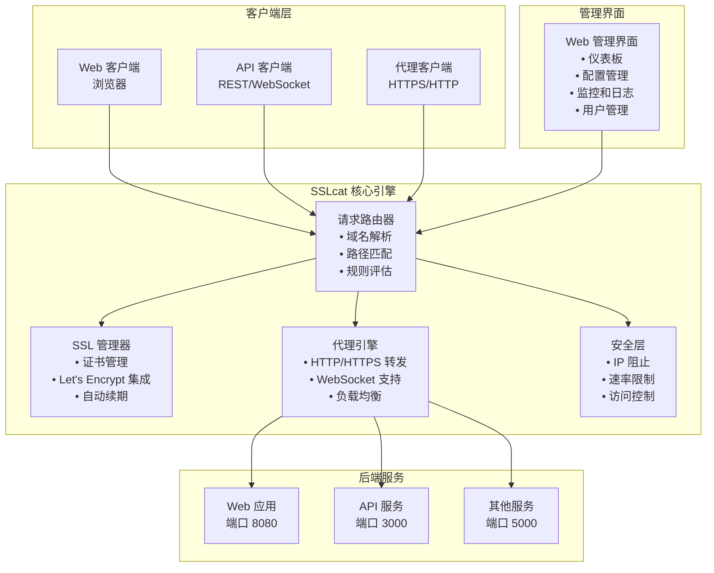
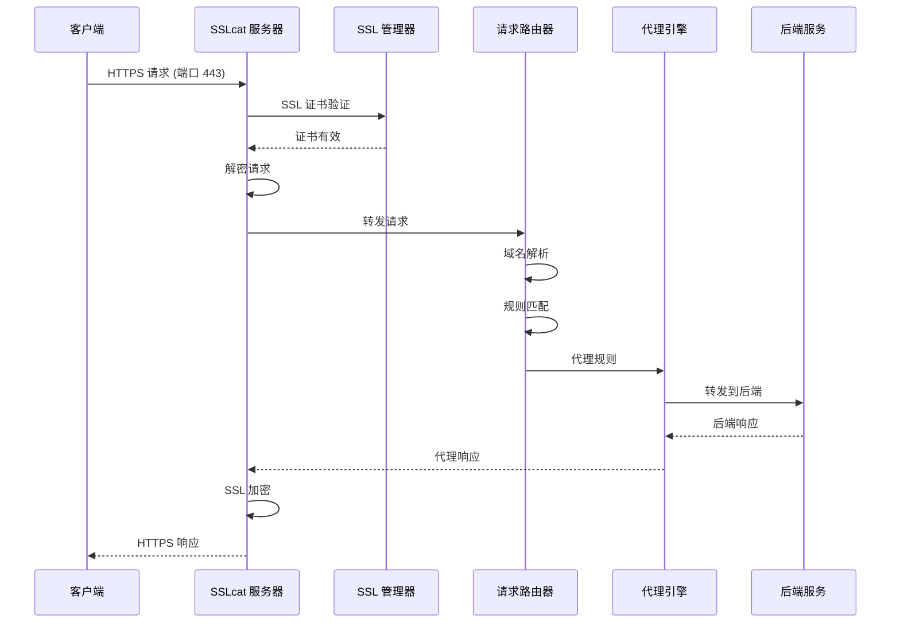
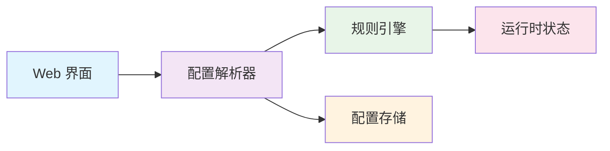
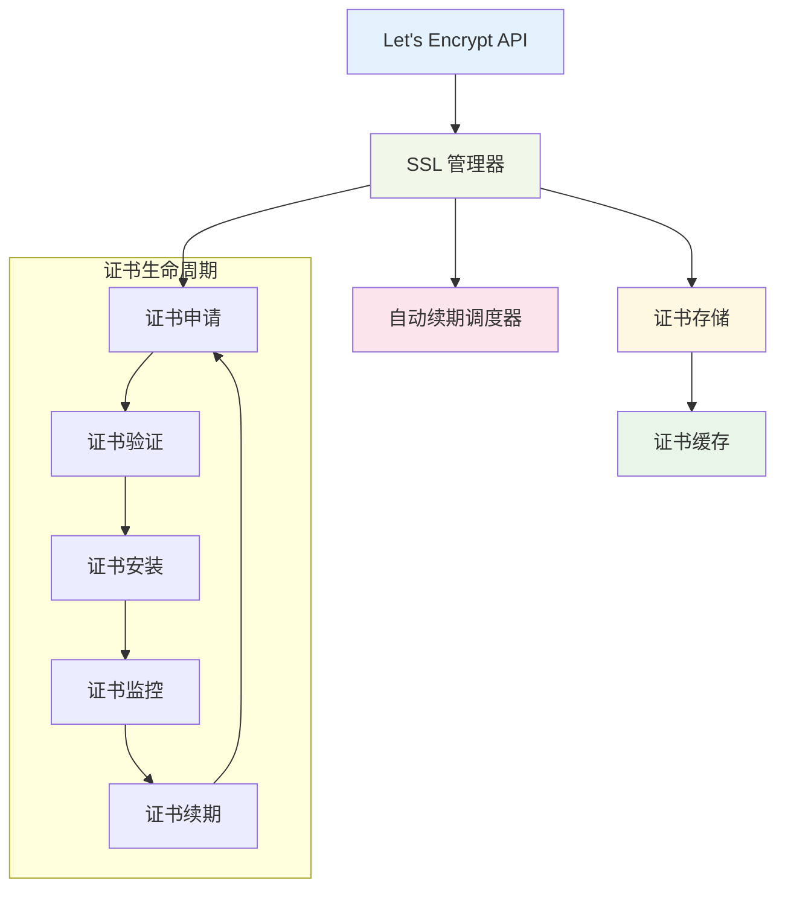

# SSLcat 架构概述

本文档提供了 SSLcat 架构、组件以及它们如何协同工作以提供 SSL 代理功能的全面概述。

## 🏗️ 系统架构

### 高级架构



## 🔧 核心组件

### 1. 请求路由器
请求路由器是所有传入请求的入口点。它处理：

- **域名解析**：确定哪个代理规则适用于请求
- **路径匹配**：将请求路径与配置的规则匹配
- **规则评估**：应用适当的代理配置
- **协议检测**：识别 HTTP 与 HTTPS 请求

### 2. SSL 管理器
SSL 管理器处理所有证书相关操作：

- **证书获取**：从 Let's Encrypt 请求证书
- **证书存储**：管理证书文件和元数据
- **自动续期**：监控证书过期并自动续期
- **证书验证**：验证证书链和信任

### 3. 代理引擎
代理引擎处理请求的实际转发：

- **HTTP/HTTPS 转发**：将请求转发到后端服务
- **WebSocket 支持**：处理 WebSocket 连接
- **负载均衡**：在多个后端之间分配负载
- **健康检查**：监控后端服务健康

### 4. 安全层
安全层提供保护和访问控制：

- **IP 阻止**：阻止恶意 IP 地址
- **速率限制**：防止滥用和 DoS 攻击
- **访问控制**：管理用户权限和认证
- **审计日志**：记录安全事件和访问尝试

## 🔄 请求流程

### 请求处理流程图



### 详细步骤说明

1. **传入请求**
   ```bash
   # 客户端发起 HTTPS 请求
   curl -I https://example.com
   ```

2. **SSL 终止**
   ```yaml
   # SSL 配置示例
   ssl:
     certificates:
       - domain: "example.com"
         provider: "letsencrypt"
         email: "admin@example.com"
         auto_renew: true
   ```

3. **域名解析**
   ```go
   // 域名解析逻辑
   func resolveDomain(host string) (*ProxyRule, error) {
       for _, rule := range config.ProxyRules {
           if rule.Domain == host {
               return &rule, nil
           }
       }
       return nil, errors.New("domain not found")
   }
   ```

4. **后端转发**
   ```yaml
   # 代理规则配置
   proxy:
     rules:
       - domain: "example.com"
         target: "http://localhost:8080"
         ssl: true
         load_balancing: "round_robin"
   ```

5. **响应交付**
   ```go
   // 响应处理
   func handleResponse(w http.ResponseWriter, resp *http.Response) {
       // 复制响应头
       for key, values := range resp.Header {
           for _, value := range values {
               w.Header().Add(key, value)
           }
       }
       // 复制响应体
       io.Copy(w, resp.Body)
   }
   ```

## 📊 数据流架构

### 配置管理流程



### 证书管理流程



## 🗄️ 存储架构

### 配置存储
- **主配置**：`/etc/sslcat/sslcat.conf` (JSON 格式)
- **备份配置**：`/opt/sslcat/backup/sslcat.conf.backup`
- **运行时配置**：内存中的配置缓存

### 证书存储
- **证书文件**：`/opt/sslcat/certs/domain.crt`
- **私钥**：`/opt/sslcat/keys/domain.key`
- **证书元数据**：`/opt/sslcat/data/certificates.json`

### 日志存储
- **访问日志**：`/opt/sslcat/logs/access.log`
- **错误日志**：`/opt/sslcat/logs/error.log`
- **安全日志**：`/opt/sslcat/logs/security.log`

### 数据存储
- **用户数据**：`/opt/sslcat/data/users.json`
- **会话数据**：`/opt/sslcat/data/sessions.json`
- **统计信息**：`/opt/sslcat/data/statistics.json`

## 🔐 安全架构

### 认证流程
```
┌─────────────────┐    ┌─────────────────┐    ┌─────────────────┐
│   用户登录      │───▶│  认证管理器     │───▶│  会话存储       │
└─────────────────┘    └─────────────────┘    └─────────────────┘
                                │                        │
                                ▼                        ▼
                       ┌─────────────────┐    ┌─────────────────┐
                       │  令牌管理器     │    │   权限验证器    │
                       │                 │    │                 │
                       └─────────────────┘    └─────────────────┘
```

### 安全层
1. **网络安全**：TLS 加密、证书验证
2. **应用安全**：输入验证、输出编码
3. **访问控制**：基于角色的权限、API 认证
4. **审计安全**：全面日志记录、安全监控

## 🚀 性能架构

### 连接池
```
┌─────────────────┐    ┌─────────────────┐    ┌─────────────────┐
│  客户端请求     │───▶│   连接池        │───▶│   后端服务      │
│                 │    │                 │    │                 │
└─────────────────┘    └─────────────────┘    └─────────────────┘
```

### 缓存策略
- **证书缓存**：内存中的证书存储
- **配置缓存**：运行时配置缓存
- **响应缓存**：静态内容缓存
- **DNS 缓存**：域名解析缓存

### 负载均衡
- **轮询**：均匀分配请求
- **健康检查**：监控后端可用性
- **故障转移**：自动后端切换
- **加权分配**：自定义后端优先级

## 🔧 配置架构

### 配置层次结构
1. **命令行**：最高优先级
2. **环境变量**：第二优先级
3. **配置文件**：默认设置
4. **内置默认值**：回退值

### 配置验证
```
┌─────────────────┐    ┌─────────────────┐    ┌─────────────────┐
│  配置输入       │───▶│  模式验证器     │───▶│  验证的配置     │
│                 │    │                 │    │                 │
└─────────────────┘    └─────────────────┘    └─────────────────┘
```

## 📈 监控架构

### 指标收集
- **系统指标**：CPU、内存、磁盘使用
- **应用指标**：请求率、响应时间
- **安全指标**：登录失败、被阻止的 IP
- **证书指标**：过期日期、续期状态

### 日志架构
```
┌─────────────────┐    ┌─────────────────┐    ┌─────────────────┐
│   应用程序      │───▶│   日志管理器    │───▶│   日志存储      │
│     事件        │    │                 │    │   (文件/数据库) │
└─────────────────┘    └─────────────────┘    └─────────────────┘
```

## 🔄 部署架构

### 单实例
```
┌─────────────────┐
│   SSLcat        │
│   (单机)        │
└─────────────────┘
```

### 高可用性
```
┌─────────────────┐    ┌─────────────────┐
│   SSLcat A      │    │   SSLcat B      │
│   (主)          │    │   (备)          │
└─────────────────┘    └─────────────────┘
```

### 负载均衡
```
┌─────────────────┐    ┌─────────────────┐    ┌─────────────────┐
│   负载均衡器    │───▶│   SSLcat A      │    │   SSLcat B      │
│                 │    │                 │    │                 │
└─────────────────┘    └─────────────────┘    └─────────────────┘
```

## 🛠️ 开发架构

### 代码组织
```
sslcat/
├── main.go                 # 应用程序入口点
├── internal/              # 内部包
│   ├── config/           # 配置管理
│   ├── ssl/              # SSL 证书处理
│   ├── proxy/            # 代理功能
│   ├── security/         # 安全功能
│   ├── web/              # Web 界面
│   └── graceful/         # 优雅重启
├── web/                  # Web 资源
│   ├── templates/        # HTML 模板
│   └── static/           # 静态文件
└── scripts/              # 实用脚本
```

### API 架构
- **REST API**：基于 HTTP 的配置 API
- **WebSocket API**：实时通信
- **内部 API**：组件间通信
- **外部 API**：第三方集成

## 🔍 故障排除架构

### 错误处理
```
┌─────────────────┐    ┌─────────────────┐    ┌─────────────────┐
│   错误检测      │───▶│   错误分类      │───▶│   错误响应      │
│                 │    │                 │    │                 │
└─────────────────┘    └─────────────────┘    └─────────────────┘
```

### 健康监控
- **服务健康**：进程状态、资源使用
- **网络健康**：连接性、延迟
- **证书健康**：有效性、过期
- **后端健康**：服务可用性、响应时间

---

*此架构为 SSLcat 的功能提供了坚实的基础。有关实现细节，请参阅[开发指南](../development/setup.md)。*
